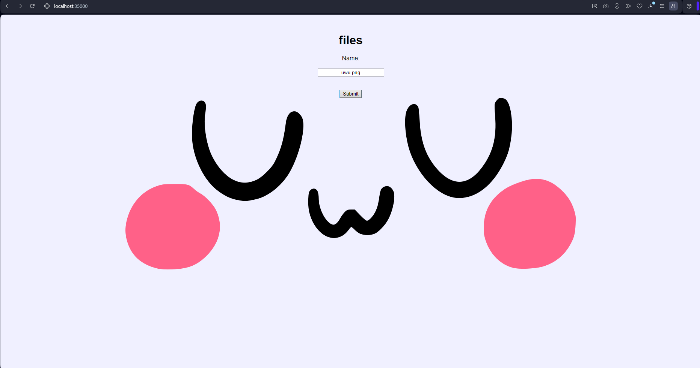
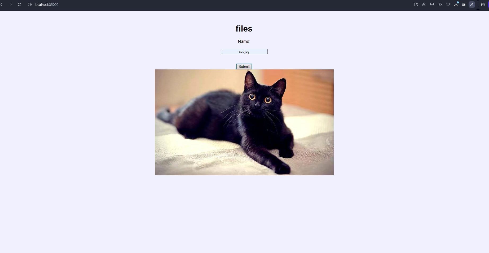
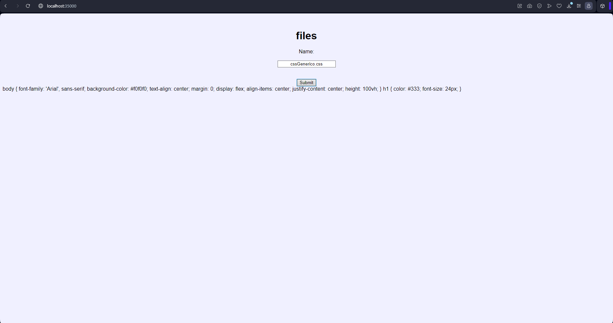
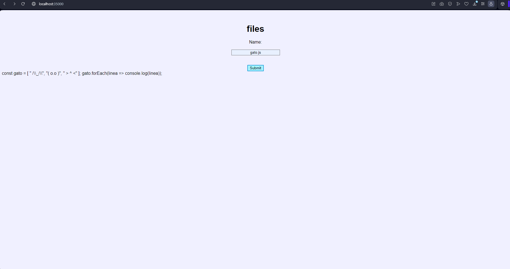
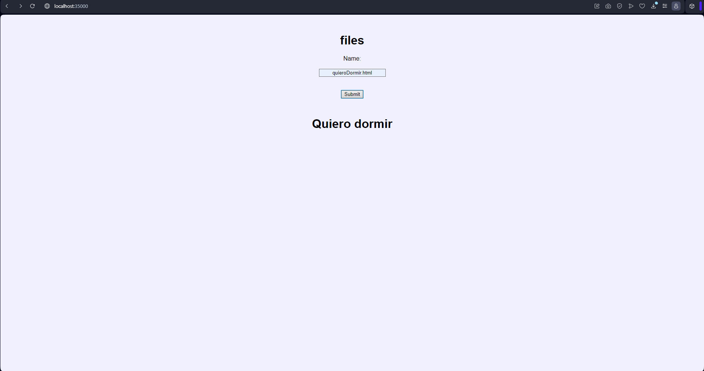

# TALLER 2: TALLER DISEÑO Y ESTRUCTURACIÓN DE APLICACIONES DISTRIBUIDAS EN INTERNET

Es una aplicación diseñada para buscar y mostrar archivos con extensiones JS, HTML, CSS, JPG y PNG en una página web. Esta aplicación tiene la capacidad de manejar múltiples solicitudes y acceder a archivos alojados en el disco local.


### Requisitos 

* [Git](https://git-scm.com/) - Control de versiones
* [Maven](https://maven.apache.org/) - Manejador de dependencias
* [Java](https://www.oracle.com/java/technologies/downloads/#java21) - Lenguaje de programación


### Instalación 

Clonamos el proyecto con el comando:

```bash
git clone https://github.com/cattus09/taller_2_AREP.git

```

## Ejecutando la aplicación

Para ejecutar la aplicación, usamos el siguiente comando en la terminal:

```bash
mvn exec:java '-Dexec.mainClass=edu.escuelaing.arep.app.HttpServer'

```

En el buscador de su preferencia ingresamos a: 

[http://localhost:35000/](http://localhost:35000/).

En esta página, tenemos la posibilidad de buscar películas y obtener detallada información sobre ellas.

## Ejecutando las pruebas 

Usamos el siguiente comando para ejecutar las pruebas:

```bash
mvn test
```

## Generando Javadoc 

Para generar la documentación de la aplicación, use el siguiente comando: 

```bash
mvn site
```

los archivos Javadoc se generarán en el directorio `target/site/apidocs` dentro del proyecto.

entre a la la carpeta `target/site/` y ejecute el `index.html` en la pagina encontrar la documentacion del trabajo 

## Descripción de la aplicación 

Esta aplicación opera como un servicio de extracción de recursos (RES), utilizando un método POST para recopilar información a partir de un URL/file. El RES abre la URL especificada y extrae el nombre del archivo. Posteriormente, obtiene el URI con los encabezados necesarios para interpretar diversos tipos de datos. Funciona como un servidor web que acepta múltiples búsquedas, presentando de esta manera los diferentes archivos almacenados en el disco. Este enfoque permite una gestión eficiente y accesible de la información almacenada, proporcionando una interfaz fácil de usar para explorar y recuperar archivos según las necesidades del usuario.

Los módulos de la aplicación incluyen:

* **HttpServer**: Contiene la implementación del servidor web de la aplicación.

## Pruebas 
* **png**:


* **jpg**:


* **css**:


* **js**:


* **html**:



## Autores 

* **Sergio gonzalez** - [cattus09](https://github.com/cattus09)


"# taller_2_AREP" 
